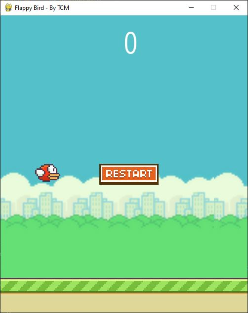

# Flappy Bird - Game Project


Welcome to Flappy Bird, a simple implementation of the Flappy Bird game in Python using the Pygame library. This project is part of my personal portfolio and was developed to enhance my programming skills.

## Table of Contents

- [Overview](#overview)
- [Requirements](#requirements)
- [How to Play](#how-to-play)
- [Screenshots](#screenshots)
- [Contributions](#contributions)
- [License](#license)

## Overview

Flappy Bird is a classic side-scrolling game where players control a bird to navigate through pipes, earning points by successfully passing through gaps.

- **Responsive Controls:** Press the space bar to make the bird jump.
- **Score Tracking:** Earn points by passing through the pipes.
- **Collision Detection:** The game stops if the bird hits the floor or collides with a pipe.
- **Reset Button:** Restart the game by clicking the reset button after a game over.

## Requirements

Before playing Flapp Bird, make sure you have Python 3 and the Pygame library installed on your system. You can install them using the following command:

```bash
pip install pygame
```

## How to Play

**1. Clone the repository:**
  ```bash
  git clone https://github.com/tiagocazali/Flappy_Bird_Game_Project
  ```

**2. Navigate to the game directory:**
  ```bash
  cd Flappy_Bird_Game_Project
  ```

**3. Start the game:**
  ```bash
  python flappy_bird.py
  ```

**4. Use the Space keys to Jump**

**5. Press "q" to close de game.**

## Screenshots



## Acknowledgments
- This game is inspired by the classic Flappy Bird game.
- Special thanks to [Hashtag Programação](https://www.youtube.com/watch?v=WSPstecsF90)
- Special thanks to [Coding With Russ](https://www.youtube.com/watch?v=GiUGVOqqCKg&list=PLjcN1EyupaQkz5Olxzwvo1OzDNaNLGWoJ)

## Contributions

Contributions are welcome! If you would like to contribute to this project, follow the steps below:

1. Fork this repository.
2. Create a new branch for your feature: `git checkout -b my-feature`
3. Commit your changes: `git commit -m 'Add a new feature'`
4. Push your changes: `git push origin my-feature`
5. Open a Pull Request

## License
This project is licensed under the MIT License - see the [LICENSE](LICENSE) file for details.